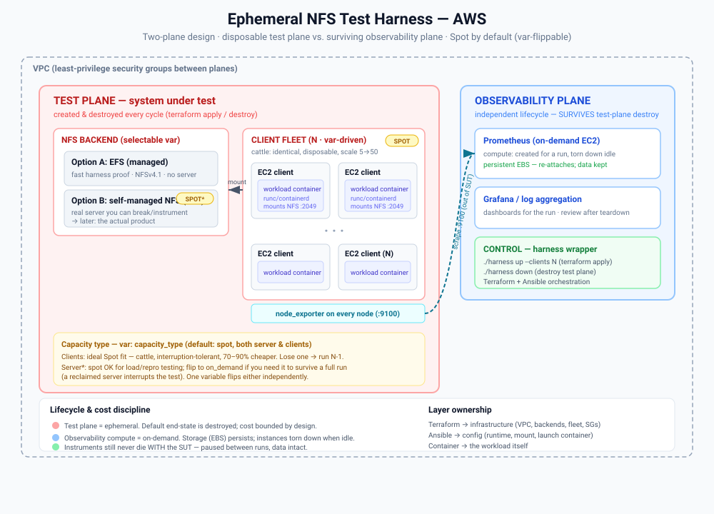

# NFS Test Harness on AWS

An **ephemeral, cost-bounded harness for load- and repro-testing NFS at scale on
AWS.** It stands up an NFS backend and a fleet of NFS client nodes, drives a
containerized `fio` workload against the share, watches the whole thing from an
**independent observability plane** (Prometheus + Grafana), and tears the test
plane down between runs — so the steady-state cost is a single small EBS volume.

It models a concrete operational task: *stand up NFS clients at scale in AWS, run
repro/test code against a backend, monitor it, and automate spin-up/tear-down for
~2-hour test cycles* — and turns "replace yourself with a small shell script" into
a literal deliverable (`bin/harness`).



---

## Validated end-to-end

This isn't a paper design — every layer has been run against real AWS:

| What | Result |
|---|---|
| `terraform apply` → fleet + EFS + guardrail | clean, EXIT 0 |
| Ansible configures the fleet | node_exporter + NFS mount + workload, `failed=0` across all nodes |
| **Live load (3× `t3.small`, EFS backend)** | **~2,700 NFS ops/s · ~97 MB/s write · ~900 ops/s per node · 80–86% CPU** |
| Observability scrapes the fleet | all node_exporters `UP`, NFS mountstats flowing to Grafana |
| Metrics volume survives instance replacement | EBS re-attached automatically on obs-box replace |
| Full teardown | `terraform destroy` EXIT 0, verified $0 left running |
| **Runs on a least-privilege IAM user** | full `apply` **and** `destroy` on a tag-scoped, granular policy (see [IAM](#least-privilege-iam)) |

---

## Architecture: two planes, two lifecycles

The core idea is a deliberate split between the system under test and the tools
watching it:

**Test plane (disposable).** The NFS backend + client fleet. Created and destroyed
every cycle. This is the system under test, so it has to be EC2 — long-lived,
stateful, kernel-level NFS clients (not Lambda, which would mask the very layer
being tested).

**Observability plane (survives).** Prometheus + Grafana on an on-demand EC2 box,
with its metrics on a **separate, persistent EBS volume** (`prevent_destroy`,
never tagged for teardown). It lives in its own Terraform state, so a
`harness down` literally cannot reach it. Rationale: *your debugging instruments
must never die with the system under test.* The compute is torn down when idle;
only the cheap EBS volume persists, holding every prior run's metrics.

The VPC, subnets, and least-privilege security groups are the shared substrate
both planes sit in.

---

## Key design decisions

1. **Two-plane split with independent state.** `harness down` flips a
   `test_plane_enabled` master switch and applies — destroying the backend + fleet
   while the network, guardrail, and (separately-stated) observability plane stand.
   No `-target` anti-pattern.

2. **Spot by default, independently flippable.** Both server and client fleet
   default to spot via `*_capacity_type` vars. Clients are textbook spot — cattle,
   interruption-tolerant, 70–90% cheaper, lose one and the run continues at N-1.
   The server is more pet: spot for repro/load tests, flip to `on_demand` for a
   clean uninterrupted benchmark. The two are independent on purpose.

3. **Selectable NFS backend, as a runtime toggle.** `nfs_backend = "efs"` proves
   the harness fast (managed, serverless storage); `"self_managed"` gives a real
   EC2 NFS server you can break and instrument. Both are `count`-gated behind one
   `nfs_endpoint` output, so the client fleet mounts identically either way — the
   trade-off is a variable, not a fork.

4. **Least-privilege security groups.** Intra-harness rules reference *other SGs by
   id*, not CIDR: NFS `:2049` only from the client SG, node_exporter `:9100` only
   from the observability SG, SSH only from `admin_cidr` (never `0.0.0.0/0`).

5. **Serverless where it actually wins — the teardown guardrail.** A scheduled
   EventBridge → Lambda reaps any `TestPlane`-tagged instance older than N hours,
   IAM-scoped so it can only terminate *this project's* tagged instances. Short,
   stateless, event-driven — the right fit for Lambda, and a cost backstop if
   someone forgets `down`.

6. **Clean layer ownership.** Terraform = infrastructure. Ansible = configuration
   (container runtime, NFS mount, launch the workload). Container = the workload
   itself. Each layer stays in its lane.

7. **Benchmark correctness: take the network out of the experiment.** The
   self-managed server defaults to a **network-optimized** instance (`c5n.large`)
   and sits in a single-AZ **cluster placement group** — never a burstable type,
   whose network baseline collapses once burst credits drain and makes results a
   function of wall-clock time. node_exporter's `ethtool` collector charts the ENA
   **`bw_in/out_allowance_exceeded`** counters, so a NIC bandwidth cap is *visible*
   rather than masquerading as "slow storage." And if a constrained link is a
   deliberate variable, a `tc` egress cap (`server_egress_cap_mbit`) imposes it
   explicitly and reproducibly instead of leaving it to credit exhaustion.

---

## Quick start

**Control node:** Linux or WSL (Ubuntu). Ansible has no native Windows control
node, so the config layer runs from there; Terraform runs anywhere.

**Prerequisites:** an AWS profile with EC2/VPC/EFS/IAM/Lambda/EventBridge access
(a tight least-privilege policy is provided — see below), and an EC2 key pair with
the private key at `~/.ssh/nfs-harness.pem`.

```bash
# 1. One-time: provision the control node (terraform, ansible, aws, jq + creds)
bash bin/bootstrap-wsl.sh

# 2. Configure
cp terraform/terraform.tfvars.example terraform/terraform.tfvars
#   set ssh_key_name and admin_cidr  (curl -s https://checkip.amazonaws.com -> "<ip>/32")
cp terraform/observability/terraform.tfvars.example terraform/observability/terraform.tfvars
#   set ssh_key_name

# 3. Run a cycle
./bin/harness up --clients 3   # apply test plane + Ansible (mount NFS, start workload)
./bin/harness obs-up           # Prometheus + Grafana, scraping the fleet
./bin/harness status           # Grafana URL + scrape targets
#   ... open Grafana, watch the load ...
./bin/harness down             # destroy the test plane; instruments + metrics stay
./bin/harness obs-down         # park observability compute; metrics volume kept
```

`harness up` flags: `--clients N`, `--backend efs|self_managed`,
`--capacity spot|on_demand` (both tiers; override one with `--client-capacity` /
`--server-capacity`), `--instance` / `--server-instance TYPE`, `--private`
(hardened private/SSM posture), `--no-pg` (skip placement group), `--no-config`
(skip Ansible). Raw `terraform` plan/apply/validate still works inside
`terraform/` and `terraform/observability/`.

---

## How it works, end to end

1. **`harness up`** — `terraform apply` stands up the VPC, SGs, NFS backend, and
   the client fleet, then the wrapper turns `terraform output` into an Ansible
   inventory and runs `site.yml`:
   - **node_exporter** on every host, with the `mountstats` + `nfs` collectors on
     — so *NFS client* operation/latency metrics flow, not just host vitals.
   - **mount** the resolved NFS endpoint (`nfs4` for EFS, `nfs` for self-managed).
   - **build + run** the workload container *on each node* (no registry needed).
2. **`harness obs-up`** — brings up the Prometheus/Grafana box, which reads the
   fleet's private IPs from the test-plane state and scrapes `:9100`. A
   provisioned dashboard renders fleet NFS ops/s, throughput, and CPU.
3. **`harness down` / `obs-down`** — tear down the SUT, then park the instruments;
   the persistent metrics volume and the guardrail remain.

The **workload** ([`workload/`](workload/)) is a tiny Alpine + `fio` image driven
by env vars (`RW`, `BLOCK_SIZE`, `FILE_SIZE`, `NUMJOBS`, `RUNTIME`, `LOOP`). Each
client writes under its own subdir so N clients don't collide, and it loops to
hold sustained, scrape-able load across the full test window.

---

## Repository layout

```
nfs-harness/
├── README.md                       # you are here
├── docs/
│   ├── SETUP_GUIDE.md              # from-scratch setup/ops guide + troubleshooting
│   ├── tight-iam-gaps.md           # the least-privilege IAM journey (gap ledger)
│   ├── iam/nfs-harness-tight-policy.json   # validated tight policy
│   └── diagrams/                   # architecture diagram
├── terraform/                      # test plane + guardrail (one state)
│   ├── providers.tf variables.tf network.tf data.tf
│   ├── nfs_backend.tf              # selectable EFS / self-managed
│   ├── clients.tf                  # spot/on-demand client fleet (var-driven count)
│   ├── teardown.tf                 # Lambda + EventBridge cost guardrail
│   ├── outputs.tf
│   └── observability/              # SEPARATE state — independent lifecycle
│       ├── main.tf                 # persistent EBS + on-demand Prometheus/Grafana
│       └── templates/cloud-init.sh.tftpl
├── ansible/                        # config layer
│   ├── site.yml ansible.cfg requirements.yml
│   └── roles/{node_exporter,nfs_client,workload}/
├── workload/                       # containerized fio NFS load generator
│   ├── Dockerfile run-load.sh
├── lambda/teardown.py              # guardrail handler
└── bin/
    ├── harness                     # control wrapper: up/configure/down/obs-up/obs-down/status
    ├── bootstrap-wsl.sh            # provision the control node
    └── apply-guardrail-policy.sh   # out-of-band helper for the guardrail role policy
```

---

## Least-privilege IAM

A standout part of this project is that it runs on a genuinely **tight,
tag-scoped IAM policy** — not an admin user. Getting there meant driving real
deploys and closing each `403` deliberately. The full journey is documented in
[`docs/tight-iam-gaps.md`](docs/tight-iam-gaps.md), with the validated policy at
[`docs/iam/nfs-harness-tight-policy.json`](docs/iam/nfs-harness-tight-policy.json).

The policy's structure encodes the real lesson: **you can't tag-gate create
actions that authorize against a parent resource** (e.g. `CreateSubnet` /
`CreateSecurityGroup` / `AttachInternetGateway` all authorize against the VPC, and
EFS mount targets can't be tagged at all). So:

- **Build actions** (create/attach/run) — allowed account-wide.
- **Destroy/modify actions** — locked to `aws:ResourceTag/Project = nfs-harness`.
  *You can create harness primitives, but you can only tear down or change things
  already tagged as the harness.*
- **IAM / Lambda / EventBridge** — scoped by ARN to `nfs-harness-*`.

Edge cases surfaced and solved along the way: `ec2:ModifyVpcAttribute` (DNS-on-VPC,
which silently halts the whole network build), `iam:GetRolePolicy` (Terraform reads
inline role policies back), the EC2-Spot service-linked role, and
`ec2:CreateNetworkInterface` (EFS places its mount-target ENI as the caller).

---

## Network posture & hardening

The harness ships with a **`private_networking` toggle** (default off) so the
cheap public layout stays available for light testing, while a single switch
flips the whole thing to a production-grade posture.

**Default (public):** one public subnet; instances get public IPs; SSH and the
Grafana/Prometheus UIs are gated to `admin_cidr` (never `0.0.0.0/0`). Good enough
for throwaway runs, cheap (no NAT).

**`private_networking = true` (or `./bin/harness up --private`):**
- the **fleet (clients + server) moves to a private subnet with no public IPs**;
- a **NAT gateway** provides egress (package/image pulls) — nothing inbound;
- access + Ansible go through **SSM Session Manager** (no SSH inbound anywhere,
  fully audited); the fleet's only inbound surface is *gone*;
- the observability box remains the single, `admin_cidr`-restricted public entry.

**Always-on hardening (both modes):**
- **NFS export scoped + squashed** — `root_squash` and exported only to the fleet
  CIDR, instead of the original `*(...,no_root_squash)` (no remote-root→local-root
  on the share, no world export).
- **All EBS volumes encrypted** (fleet roots, server export, obs box, metrics).
- **Prometheus HTTP basic auth** — the box bcrypt-hashes the password at boot and
  wires Grafana's datasource with the creds (Prometheus had *no* auth before).
- **IMDSv2 required**, SSH key-only.

The private posture's IAM surface (NAT/EIP, the SSM transfer bucket, SSM sessions,
the instance profile) is in the policy file and documented as gap #11 in
[`docs/tight-iam-gaps.md`](docs/tight-iam-gaps.md). It's `terraform validate`/`plan`
clean; the Ansible-over-SSM path needs the `session-manager-plugin` and the
`community.aws` collection on the control host, and should be confirmed on the
first private deploy.

---

## Lifecycle & cost model

- **Idle:** one small `gp3` EBS volume (observability metrics) ≈ a couple dollars
  a month. Nothing else runs between cycles.
- **During a run:** 3× `t3.small` on-demand + EFS + the obs box + a 10 GB EBS
  ≈ **$0.12/hr**. On spot, the fleet is 70–90% cheaper.
- **Private posture** adds a NAT gateway (~$0.045/hr + data) — the price of zero
  inbound surface. Off by default; only incurred with `private_networking`.
- **Guardrail:** even a forgotten test plane self-destructs after N hours.

---

## Tech stack

Terraform (AWS provider v5) · Ansible · Docker + `fio` · Prometheus + Grafana ·
`node_exporter` (mountstats/nfs) · AWS EC2 / EFS / VPC / Lambda / EventBridge /
IAM · Amazon Linux 2023.

---

## Trade-offs named (and why)

- **Single public subnet.** Sufficient for a throwaway harness; a production
  design would split public/private subnets + NAT. Deliberate simplification.
- **EFS vs self-managed.** EFS proves the harness fast but hides the server layer;
  self-managed gives a server you can break/instrument. Hence the runtime toggle.
- **Fargate rejected for clients.** Less kernel/NFS-client control (the thing being
  tested) and pricier than spot. EC2 is the point here.
- **Guardrail is intentionally out-of-band.** It terminates by tag and leaves
  Terraform state stale by design — cost-stop beats state-tidiness for a backstop;
  reconcile with the next `apply`.

## TODO / planned improvements

This is a working PoC; these are the next features on the roadmap (not yet built):

- [ ] **Mixed-backend comparison runs.** Today one `harness up` stands up a single
  backend (`--nfs efs` *or* `--nfs self_managed`) with one client count. Planned: a
  single run that stands up **both** backends at once with independent client
  counts — e.g. `harness up --efs-clients 5 --self-managed-clients 10` — so the
  same workload can be A/B'd against EFS and a self-managed server side by side in
  one Grafana view. (Needs the backend resources de-coupled from the single
  `nfs_backend` toggle, separate client pools per backend, and per-pool scrape
  labels.)
- [ ] **Self-managed server sizing & scale.** `--server-instance TYPE` already
  exists; add `--servers N` for a multi-server self-managed backend (and per-pool
  instance types) so the server tier can be scaled/compared too. *(Nice-to-have.)*
- [ ] **Per-run guardrail TTL flag.** Surface `max_test_plane_age_hours` as a
  `harness up --ttl` flag instead of a tfvars edit (currently bumped manually for
  long/overnight runs).

## Possible extensions

- S3 remote state + DynamoDB locking (upgrade path is stubbed in `providers.tf`).
- Autoscaling-group client fleet with mixed-instances spot policy.
- Grafana alerting on NFS latency/error-rate thresholds; longer-retention TSDB.
- Wire in the actual storage product as a third `nfs_backend` option.
- CI that runs `terraform validate` + `tflint` + a plan on PRs.

See [`docs/SETUP_GUIDE.md`](docs/SETUP_GUIDE.md) for a from-scratch setup + troubleshooting guide.
